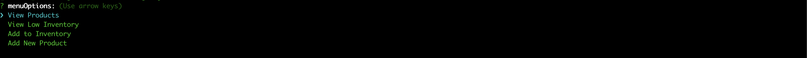
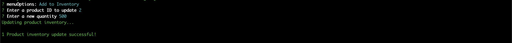
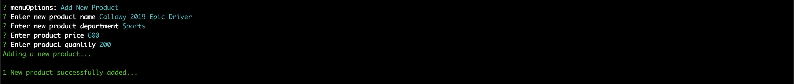

# bamazon
Command line storefront application utilizing MySql

bamazon is a command line store front application that allows users to view and purchase products from the virtual store through the bamazonCustomer app, manage product inventory through the bamazonManger app and view storefront total profits via the bamazonSupervisor app. Propmts and responses are managed through the inquirer.js npm command line interface.

#bamazonCustomer
Customers are first introduced with the available items, and then prompted to select an item id to purchase. Upon entering a product ID, they are then asked for a quantity to purchase, and finally displayed a total cost analysis of their purchase.

#bamazonManager
The manager application allows users to view the storefront from a manager's perspective - they have the option to "View Products", "View Low Inventory", "Add to Inventory", or "Add a New Product" to the storefront.

When the user chooses to add inventory to the storefront, they simply enter the product id of that they wish to update, followed by the new inventory total.

And when a user chooses to add a new product in the bamazonManager app, they're first promted to enter a product name, followed by a prompt to enter the appropriate product department, a product price, and the quantity of product for the storefront.

#bamazonSupervisor

#Roadblocks
-queries involving internal mysql structure

#Built With
Node.js  
MySQL for database  
Inquirer.js NPM for command line interface  
JavaScript  

#Authors
Tony Bee

